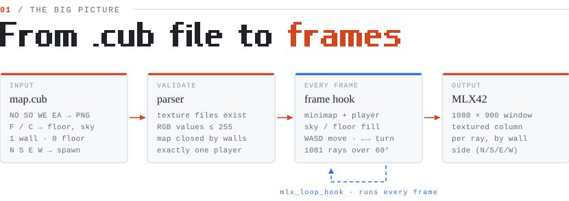
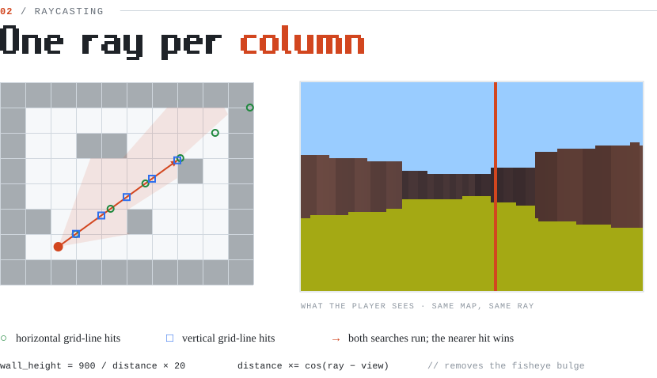

<picture>
  <source media="(prefers-color-scheme: dark)" srcset="docs/banner-dark.svg" />
  
</picture>

<picture>
  <source media="(prefers-color-scheme: dark)" srcset="docs/pipeline-dark.svg" />
  
</picture>

<picture>
  <source media="(prefers-color-scheme: dark)" srcset="docs/raycasting-dark.svg" />
  
</picture>

For every one of the 1081 screen columns, a ray leaves the player at its own angle across a 60° field of view. Two searches walk the grid in 20-unit steps, one along horizontal grid lines and one along vertical ones, until each meets a wall. The nearer hit wins, its distance is corrected with `cos(ray − view)` so straight walls don't bulge, and a column `900 / distance × 20` pixels tall is painted with the texture of the wall face that was hit (N, S, E or W).

## Run it

```bash
make
./CUB3D maps-2/good/library.cub
```

`W` `A` `S` `D` move · `←` `→` turn · `Esc` quit. Maps that must be rejected live in `maps-2/bad/`.

<sub>Diagrams in <code>docs/</code> are generated SVGs, drawn to match the code in this repo.</sub>
